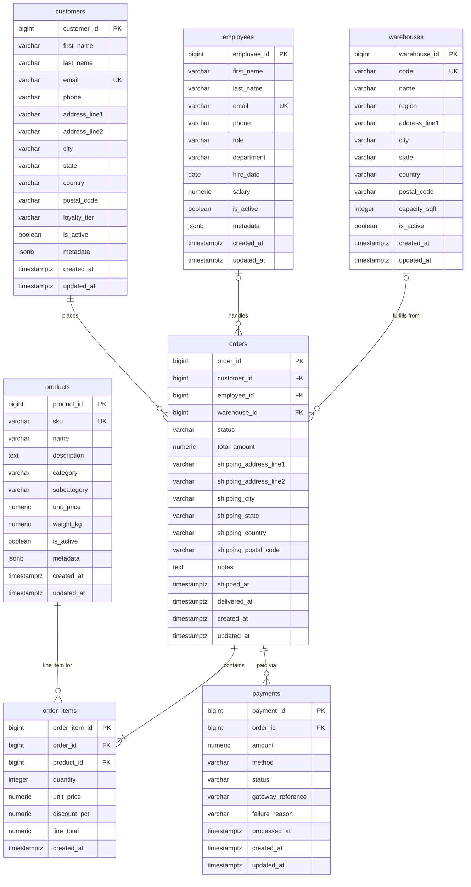

# OrderFlow — Schema Reference

Schema: `orderflow`  
Migration: `database/migrations/001_initial_schema.sql`  
Status: **Milestone 1 — In Review**

This document is the human-readable companion to the DDL. Every change to the
DDL must be reflected here before the milestone is approved. After approval,
both files are frozen.

---

## Entity-Relationship Diagram

---

## Relationships Summary

| From | To | Cardinality | FK Column | Notes |
|------|----|-------------|-----------|-------|
| customers | orders | 1 : many | `orders.customer_id` | Required; every order has one customer |
| employees | orders | 1 : many (nullable) | `orders.employee_id` | Optional; not every order has an assigned employee |
| warehouses | orders | 1 : many (nullable) | `orders.warehouse_id` | Optional; assigned at creation |
| orders | order_items | 1 : many (at least 1) | `order_items.order_id` | `ON DELETE CASCADE`; INV-10 requires ≥1 item |
| products | order_items | 1 : many | `order_items.product_id` | Snapshot pattern: price copied at insert |
| orders | payments | 1 : many | `payments.order_id` | Multiple rows per order (retries + refund) |

---

## Table Reference

### `employees`

Stores all internal employees. The role column drives RLS policy definitions
in Lab 09.

| Column | Type | Notes |
|--------|------|-------|
| `employee_id` | `BIGINT IDENTITY` PK | |
| `email` | `VARCHAR(255)` UNIQUE | Login identity; PII candidate for pgcrypto (Lab 09) |
| `role` | `VARCHAR(50)` | `warehouse_staff` \| `courier` \| `finance` \| `manager` \| `admin` |
| `salary` | `NUMERIC(12,2)` | Plain-text in M1; encrypted in Lab 09 via pgcrypto |
| `metadata` | `JSONB` | Certifications, skills; GIN index in Lab 05 |

**Future labs:** RLS (09), pgcrypto (09), pg_trgm/GIN (05), JSONB (05)

---

### `customers`

Stores all customers. The address columns are the customer's default billing
address; orders carry their own shipping address snapshot.

| Column | Type | Notes |
|--------|------|-------|
| `customer_id` | `BIGINT IDENTITY` PK | |
| `email` | `VARCHAR(255)` UNIQUE | PII candidate for pgcrypto (Lab 09) |
| `loyalty_tier` | `VARCHAR(20)` | `bronze` \| `silver` \| `gold` \| `platinum` |
| `metadata` | `JSONB` | Preferences, A/B flags; GIN index in Lab 05 |

**Future labs:** RLS (09), pgcrypto (09), pg_trgm/GIN (05), JSONB (05)

---

### `products`

Current product catalog. `unit_price` is the live list price and can change
at any time; historical order pricing is preserved in `order_items.unit_price`.

| Column | Type | Notes |
|--------|------|-------|
| `product_id` | `BIGINT IDENTITY` PK | |
| `sku` | `VARCHAR(100)` UNIQUE | Natural join key for FDW external catalog (Lab 10) |
| `description` | `TEXT` | FTS target; tsvector column added in Lab 05 |
| `metadata` | `JSONB` | Variant attributes (size, color, specs); GIN index in Lab 05 |

**Future labs:** FTS/pg_trgm (05), GIN/JSONB (05), pgvector (10), FDW (10)

---

### `warehouses`

Physical warehouse locations. The `region` column is the FDW foreign-server
key and must match `config.yaml` warehouse region values exactly.

| Column | Type | Notes |
|--------|------|-------|
| `warehouse_id` | `BIGINT IDENTITY` PK | |
| `code` | `VARCHAR(20)` UNIQUE | Short identifier (e.g. `WH-USE-01`) |
| `region` | `VARCHAR(50)` | Values from `config.yaml`; FDW server per region in Lab 10 |
| `capacity_sqft` | `INTEGER` | Used by workers for warehouse selection logic |

**Future labs:** FDW (10), replication topology (07)

---

### `orders`

The highest-volume, highest-value table. The natural partition candidate.
`created_at` is the future RANGE partition key; the table is plain in M1.

| Column | Type | Notes |
|--------|------|-------|
| `order_id` | `BIGINT IDENTITY` PK | |
| `status` | `VARCHAR(20)` | State machine — see `business_rules.md §1` |
| `total_amount` | `NUMERIC(12,2)` | Denormalized; must equal SUM(order_items.line_total) — INV-06 |
| `shipping_address_*` | `VARCHAR` | Snapshot from customers at creation time |
| `shipped_at` | `TIMESTAMPTZ` | Set when status → SHIPPED |
| `delivered_at` | `TIMESTAMPTZ` | Set when status → DELIVERED |
| `created_at` | `TIMESTAMPTZ` | Future RANGE partition key (Lab 06) |

**Future labs:** RANGE partitioning (06), BRIN (05), logical replication (07), pgBackRest PITR (08), pgaudit (09)

---

### `order_items`

Immutable after insert (INV-07). `line_total` is a `GENERATED ALWAYS AS STORED`
column. No `updated_at` column — updates are a data integrity violation.

| Column | Type | Notes |
|--------|------|-------|
| `order_item_id` | `BIGINT IDENTITY` PK | |
| `order_id` | `BIGINT` FK | `ON DELETE CASCADE` |
| `product_id` | `BIGINT` FK | |
| `unit_price` | `NUMERIC(10,2)` | Snapshot of `products.unit_price` at order time |
| `discount_pct` | `NUMERIC(5,2)` | 0–100; default 0 |
| `line_total` | `NUMERIC(12,2)` | `GENERATED ALWAYS AS STORED`; `quantity × unit_price × (1 - discount_pct/100)` |

**Future labs:** B-tree/covering indexes (05), FK cascade (04), join analysis (05), generated columns (04)

---

### `payments`

Multiple rows per order are normal (retries + refund). Only one `SUCCESS` row
per order is permitted (INV-05); enforced by workers in M1, partial unique
index added in Lab 05.

| Column | Type | Notes |
|--------|------|-------|
| `payment_id` | `BIGINT IDENTITY` PK | |
| `order_id` | `BIGINT` FK | |
| `amount` | `NUMERIC(12,2)` | Must be > 0 |
| `method` | `VARCHAR(30)` | `credit_card` \| `debit_card` \| `paypal` \| `bank_transfer` \| `wallet` |
| `status` | `VARCHAR(20)` | `PENDING` → `SUCCESS` or `FAILED`; or `REFUNDED` |
| `gateway_reference` | `VARCHAR(255)` | Processor txn ID; encrypted in Lab 09 |
| `failure_reason` | `VARCHAR(255)` | Populated on FAILED payments |
| `processed_at` | `TIMESTAMPTZ` | Set when status leaves PENDING |

**Future labs:** pgaudit (09), MVCC/isolation (04), pgcrypto (09), pg_cron (10), rollback/savepoint (04)

---

## Constraints Added Per Milestone

| Constraint | Table | Column(s) | Milestone |
|------------|-------|-----------|-----------|
| `orders_shipped_before_delivered` CHECK | `orders` | `shipped_at`, `delivered_at` | M1 |
| Partial UNIQUE on SUCCESS payments | `payments` | `(order_id) WHERE status='SUCCESS'` | Lab 05 |
| RLS policies | `employees`, `customers` | row-level | Lab 09 |

---

## What Is Deliberately Absent

These items are **not** missing by accident — they are excluded to keep the
schema focused on the DBA concepts being taught:

| Absent Item | Reason |
|-------------|--------|
| `inventory` table | Inventory management adds complexity without enabling any targeted DBA lab |
| `suppliers` table | No procurement simulation needed; FDW lab uses a simulated external catalog |
| `invoices` table | Financial reporting is not a lab topic; payments table is sufficient |
| `coupons` table | Discount logic is modeled as `discount_pct` on `order_items` |
| `reviews` table | No recommendation or rating labs in scope |
| Indexes | All indexes are Lab 05 work — adding them now would skip the teaching moment |
| Partitioning | Lab 06 work — the table is created plain so the conversion is the exercise |
| pgvector column | Lab 10 work — requires the pgvector extension to be installed first |
| tsvector column | Lab 05 work — added alongside the GIN index as one unit |
